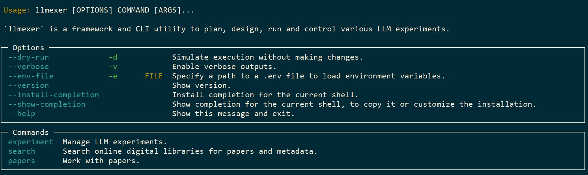
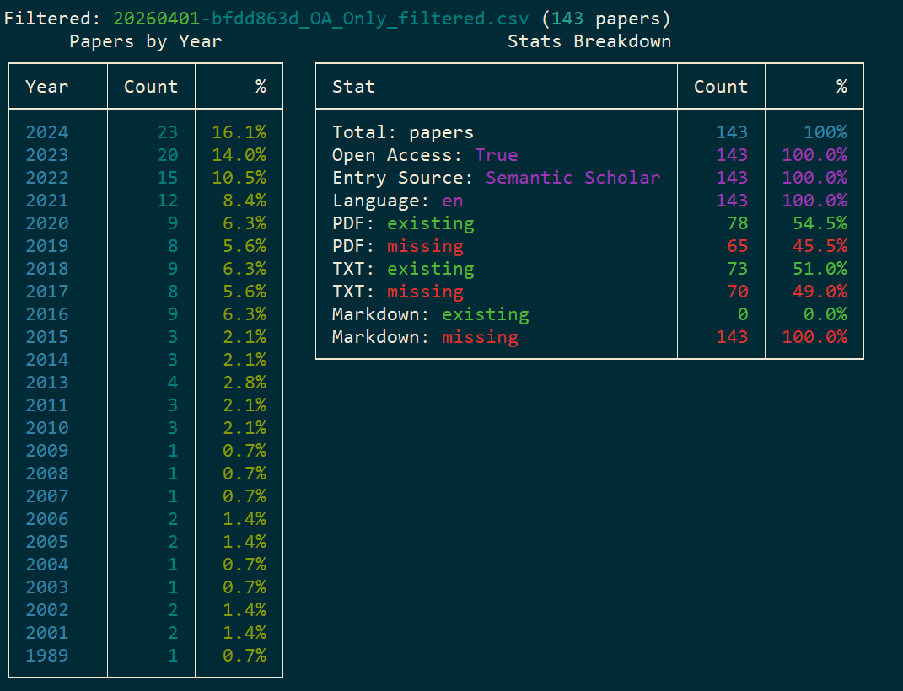
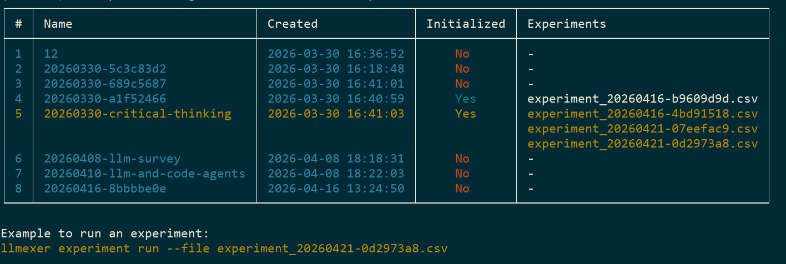

## 🔰About

`llmexer` is a framework and CLI utility to plan, design, run and control various LLM experiments

> 🪄 The philosophy of the tool is: `everything` is a `file`. Projects, experiments, searches, configs, and further items will be saved as files. The CLI helps you to modify most of the files, but the same files could be modified manually (e.g., adding new LLM model, modification of search search, paper PDFs could be manually added, the SQLite database with generated experiments could be inspected and edited etc.).

## 📦 Installation

* Clone this repo and follow steps from `Development Setup`

## 🧩 Development Setup

This guide walks through setting up the project for local development using `uv`.

1. Create a new virtual environment in a `.venv` directory and activates it.
    ```bash
    uv venv
    ```
1. Activate the environment (macOS/Linux):
   ```
   source .venv/bin/activate
   ```
1. Activate the environment (Windows):
    ```
    call .venv/Scripts/activate.bat
    ```
1.  Install package in **editable mode** with **dev** dependencies
    Installing the package in **editable mode** (`-e`) is the key to development. It links the `llmexer` command in your environment directly to your source code.
    ```bash
    uv pip install -e . --group dev
    ```

## ⚙️ Configuration

This tool requires access to local or remote running LLMs. It uses a `.env` file to securely load your API credentials, and also set the current project.

1.  Create a `.env` file in the root of the project
2.  Set the current project ID (optional):
    ```env
    PROJECT_ID=20260330-3a9adf70
    ```
3.  Configure the docling backend (optional, used by `papers extract --processor docling`):
    ```env
    DOCLING_URL=http://localhost:5001/
    DOCLING_USER=myuser
    DOCLING_PASSWORD=mypassword
    ```
4.  Set the API key for LLM providers (optional, used by `experiment run` for ollama, vllm, OpenAI, Gemini):
    ```env
    # Base URL for a specific provider
    PROVIDER_OLLAMA_URL=http://localhost:11434/v1
    PROVIDER_VLLM_URL=http://localhost:8000/v1

    # The API key for a specific provider (takes precedence over LLM_API_KEY)
    PROVIDER_OPENAI_KEY=sk-...
    ```
     The pattern is `PROVIDER_<PROVIDER_UPPER>_URL` and `PROVIDER_<PROVIDER_UPPER>_KEY` where `<PROVIDER_UPPER>` is the provider name in uppercase (e.g. `OLLAMA`, `VLLM`, `OPENAI`, `GEMINI`).
5. If you would like to change the envs based on the project run (e.g., just test a LLM provider for a particular project), you could also pass a custom file as `.env` to the CLI:
    ```
    llmexer --env-file custom.env
    ```

## 🚀 Getting Started

A typical end-to-end workflow for collecting and processing papers inside a project:

**1. Create a new project**
```bash
llmexer project create
# Output: created project '20260402-a1b2c3d4'
```

**2. Give it a meaningful name**
```bash
llmexer project rename --old-id 20260402-a1b2c3d4 --new-id llm-survey-2026
```

**3. Initialise the project structure**

Scaffold a standard `experiment/` subfolder with template CSVs and a prompt file:
```bash
llmexer experiment init --pid llm-survey-2026
```

<details>
Initialization of the project creates following files (inside <PROJECT_NAME> folder):
- `experiment/llm-models.csv` — list of models to use (name, provider, notes); pre-filled with `gemma4:31b`, `phi4:14b`
- `experiment/data.csv` — input data rows (ID, Title, Abstract)
- `experiment/mapping.csv` — maps data IDs to prompt IDs; pre-filled with `D01;prompt01` and `D02;prompt01`
- `experiment/prompts/prompt01.txt` — a starter Jinja2 prompt template using `{{title}}` and `{{abstract}}`
- `experiment/llm-params.csv` — LLM hyperparameter profiles; identity columns: `provider`, `model_name`, `profile_name`; universal columns: `temperature`, `top_p`, `max_tokens`; provider-grouped columns: `ollama_context_window`, `ollama_repeat_penalty` (ollama), `vllm_min_p`, `vllm_best_of` (vllm), `openai_seed` (openai), `gemini_thinking_level` (gemini); pre-filled with example profiles for `ollama`, `openai`, `vllm`, and `gemini`
</details>

**4. Generate the full experiment database**

After filling in `experiment/llm-models.csv`, `experiment/data.csv`, `experiment/mapping.csv`, `experiment/llm-params.csv`, and your Jinja2 prompt templates:
```bash
llmexer experiment generate --pid llm-survey-2026
```

<details>

This renders every (data row × prompt × LLM models × LLM parameters) combination and writes a self-contained SQLite database `experiment/experiment_<YYYYMMDD>_<NN>.db` (`<NN>` is a zero-padded counter starting at `01`). Each LLM provider gets its own table (e.g. `experiment_ollama`, `experiment_openai`) holding the rendered prompt, model identity, that provider's hyperparameter columns, and the SHA-256 hashes — plus the result columns that `experiment run` fills in later. The `code` field encodes each combination as `DATAID_PROMPTID_MODELNAME_PROFILENAME`. Use `--dry-run` to preview the row count without writing:
```bash
llmexer --dry-run experiment generate --pid llm-survey-2026
```
</details>

> 💡 **Hint — external tools:** the generated experiment store is a SQLite database
> (`experiment/experiment_*.db`). Beyond the CLI, you can open and edit it directly with any
> external SQLite tool — for example [DBeaver](https://dbeaver.io/).

**5. Run the experiment - call LLMs and collect results**

Once `experiment generate` has produced the database, run all combinations:
```bash
llmexer experiment run --pid llm-survey-2026 --file experiment_<SAMPLE>.db
```

<details>

This reads every row from the generated database (`experiment_*.db`, which already contains all param columns) and calls the appropriate LLM. With no `--file` it uses the newest `experiment_*.db`. Results are written **back into the same database in place** — each row's response, status, token usage, and timestamps are updated on its provider table, so the database stays the single source of truth (no separate results file). Re-running skips rows that already finished successfully and updates the rest. Each individual call is also saved as a JSON file under `experiment/responses/`. Both the per-call JSON and the database `response_json` column include the **complete raw backend response** under `raw_response` (all provider fields — e.g. `finish_reason`, per-token `usage`, and ollama extras like `eval_count` / `*_duration`), not just the response text and total token count.

Use `--dry-run` to preview the row count without making any LLM calls:
```bash
llmexer --dry-run experiment run --pid llm-survey-2026
```

Run only a specific provider's rows (e.g. when only ollama is available):
```bash
llmexer experiment run --pid llm-survey-2026 --filter-provider ollama
```

Run a single combination by its `ID` (or `code`):
```bash
llmexer experiment run --pid llm-survey-2026 \
  --file experiment_<SAMPLE>.db --id 1
```

</details>

**6. Inspect experiment statistics**

Get aggregate statistics (total, finished, running, errors, total tokens, and per-provider / per-model breakdowns). The per-model table reports, for each model, `requests`, `finished`, `open` (pending/unrun), `time total` (HH:MM:SS elapsed over finished requests), `average time` (HH:MM:SS mean elapsed per finished request), and `tokens` (summed over finished requests). With no `--file` it reads the project's single `experiment_*.db` (pass `--file` if several exist):
```bash
llmexer experiment stats --pid llm-survey-2026
```
Pass `--file` to inspect a specific database instead:
```bash
llmexer experiment stats --pid llm-survey-2026 --file experiment_<SAMPLE>.db
```

The API key is read from `.env` (pattern -> `PROVIDER_<PROVIDER_UPPER>_KEY`).

P.S.: CLI interfaces could become very complex with the time, thus refer to the `--help` to get options and parameters of the utility:
```bash
llmexer --help
```

## 📢 Scenario 1: Gathering data for projects by adding papers

**1. Add papers to the project** - local file

From a local file:
```bash
llmexer papers add --pid llm-survey-2026 --file ~/Downloads/attention-is-all-you-need.pdf
```
**2. Add papers to the project** - from directory

From a directory of PDFs:
```bash
llmexer papers add --pid llm-survey-2026 --directory ~/Downloads/papers/
```

**3. Add papers to the project** - from url
From a URL:
```bash
llmexer papers add --pid llm-survey-2026 --url https://arxiv.org/pdf/1706.03762
```

## 📢 Scenario 2: Gathering data for projects by running search

**1. Run a literature search**

Create a search configuration and run it:
```bash
llmexer search create --pid llm-survey-2026 --query "large language models"
llmexer search list --pid llm-survey-2026
llmexer search run --pid llm-survey-2026 --file 20260401-bfdd863d.yaml
```

Or run directly from a query string:
```bash
llmexer search run --pid llm-survey-2026 --query "large language models" --limit 500
```

Results are saved as `<ID>__results.csv` in `searches/` (the raw JSON is saved as `<ID>__results_raw.json` in `searches/jsons/`).

**2. Filter search results by excluding rows (optional)**

`filter` **excludes** rows by one or more criteria and writes `<ID>__filtered.csv`. Filters chain: each run reads the existing `__filtered.csv` (or the `__results.csv` if none) and rewrites it. Combine `--language`, `--source`, `--doi`, `--downloaded` in one run:
```bash
# drop German rows and rows still not downloaded
llmexer search filter --pid llm-survey-2026 --file 20260401-bfdd863d.yaml --language de --downloaded
```
Every applied filter is recorded in `searches/logs/filters-applied.log`.

## 📢 Scenario 3: Gathering data by downloading papers and extracting text

**1. Download open-access papers by DOI via Unpaywall**

Download by DOI (one or more):
```bash
llmexer papers download --pid llm-survey-2026 --doi 10.1038/nature12373 --email you@example.com
```
Download from a full search result CSV (downloads all papers with a DOI, names each file `YEAR_AUTHOR_TITLE_DOI.pdf`):
```bash
llmexer papers download --pid llm-survey-2026 --search-file 20260401-bfdd863d__results.csv
```
Or from a filtered CSV to download only the papers that passed the language filter:
```bash
llmexer papers download --pid llm-survey-2026 --search-file 20260401-bfdd863d__filtered.csv
```
Failed downloads are saved automatically as `20260401-bfdd863d__results_download_failed.csv` (columns: `doi`, `url`, `title`, `desired_filename`, `downloaded`) in the `searches/logs/` folder. After a `--search-file` download completes, the search is automatically synced against the `papers/` folder in **existing-only** mode — it updates `pdf_downloaded` (and text/markdown companions) for the listed rows but does not add new rows for unrelated PDFs.

**2. Extract text from all added papers** - pypdf

Using the default `pypdf` backend (saves `.txt` files):
```bash
llmexer papers extract --pid llm-survey-2026
```

**3. Extract text from all added papers** - docling

Using the `docling` backend for richer Markdown output (saves `.md` files), reading connection details from `.env`:
```bash
llmexer papers extract --pid llm-survey-2026 --processor docling
```

Override `.env` connection settings at runtime:
```bash
llmexer papers extract --pid llm-survey-2026 --processor docling \
  --docling-url http://myserver:5001/ \
  --docling-user admin \
  --docling-password secret
```

By default, papers that already have an extracted file are skipped. Use `--rewrite` to force re-extraction:
```bash
llmexer papers extract --pid llm-survey-2026 --rewrite
```

#### Using Current Project ID

Many commands support the `--pid` parameter to specify which project to work with. If you set `PROJECT_ID` in your `.env` file, you can omit this parameter and the commands will use the current project automatically:

```bash
# Set in .env
PROJECT_ID=my-project

# These commands will use my-project automatically
llmexer search run --query "machine learning"
```

You can still override the current project by explicitly providing `--pid`:
```bash
llmexer search run --pid different-project --query "deep learning"
```

## 🗂️ CLI category: **project**

The `project` (alias: `proj`) category provides commands for managing LLM projects (the top-level container for experiments, papers, and searches):

| Command   | Description | Command Example |
|-----------|-------------|-----------------|
| `create` | Create a new project folder under `.projects/` using format `YYYYMMDD-GUID`. Accepts an optional custom ID. | `llmexer project create --id my-project` |
| `current` | Display the current project ID loaded from `.env`. | `llmexer project current` |
| `rename` | Rename an existing project. Uses `PROJECT_ID` from `.env` if `--old-id` is omitted. | `llmexer project rename --old-id old-name --new-id new-name` |

## 🧪 CLI category: **experiment**

The `experiment` (alias: `exp`) category provides commands for initialising, generating, and running LLM experiments inside a project:

| Command   | Description | Command Example |
|-----------|-------------|-----------------|
| `init` | Initialise an existing project with a standard folder structure (`experiment/`, `experiment/prompts/`) and template files: `llm-models.csv` (pre-filled with example ollama models), `data.csv`, `mapping.csv` (pre-filled with D01 and D02 rows), `prompts/prompt01.txt` (Jinja2 template using `{{title}}` and `{{abstract}}`), and `llm-params.csv` (hyperparameter profiles; universal: `temperature`, `top_p`, `max_tokens`; ollama: `ollama_context_window`, `ollama_repeat_penalty`; vllm: `vllm_min_p`, `vllm_best_of`; openai: `openai_seed`; gemini: `gemini_thinking_level`). Raises an error if already initialised. | `llmexer experiment init --pid my-project` |
| `copy-papers` | Copy parsed papers (`.md`/`.txt`) from the project's `papers/` folder into `experiment/data.csv` as rows `ID;filename;content`, with IDs `P01`, `P02`, … ordered alphabetically by filename (`.md` preferred over `.txt` when both exist). An existing `data.csv` is backed up to `data_backup_<YYYYMMDD>_<NN>.csv` first. | `llmexer experiment copy-papers --pid my-project` |
| `copy-search` | Copy a search results CSV (`--file`, absolute or relative to the project's `searches/` folder) into `experiment/data.csv` as rows `ID;Title;Abstract;doi;authors`, with IDs `S01`, `S02`, … preserving the source file's row order. An existing `data.csv` is backed up to `data_backup_<YYYYMMDD>_<NN>.csv` first. | `llmexer experiment copy-search --pid my-project --file <SEARCH_ID>__results.csv` |
| `generate` | Render all (data row × prompt × LLM models × LLM parameters) combinations and write a self-contained SQLite database `experiment/experiment_<YYYYMMDD>_<NN>.db` (`<NN>` is a zero-padded counter starting at `01`). Each LLM provider gets its own table (e.g. `experiment_ollama`) with columns `ID`, `code` (`DATAID_PROMPTID_MODELNAME_PROFILENAME`), `prompt`, `tokens_estimate`, `original_data`, `model_name`, `provider_name`, that provider's param columns from `llm-params.csv` (`profile_name`, `temperature`, `top_p`, `max_tokens`, plus the provider-specific ones, e.g. `ollama_context_window`, `ollama_repeat_penalty`), the `prompt_hash` / `original_data_hash` columns, and the result columns filled in by `run`. Rows are sorted by model order from `llm-models.csv`. Supports `--dry-run`. | `llmexer experiment generate --pid my-project` |
| `run` | Execute every row in the generated database `experiment_*.db` (no separate params file needed — all columns are embedded). Calls each LLM via the OpenAI SDK (supports ollama, vllm, openai, gemini) and writes results **back into the same database in place** (response, status, token usage, timestamps, plus the complete raw backend response under `raw_response`); re-runs skip rows that already finished successfully and update the rest. Individual JSON responses are saved under `experiment/responses/`. Supports `--dry-run`, `--file` (choose a specific `.db`, defaults to the newest), `--filter-provider` (only run rows for a specific provider), `--id` (run a single combination by its `ID` or `code`). API key read from `LLM_API_KEY` or `PROVIDER_<PROVIDER_UPPER>_KEY` env vars; URL from `PROVIDER_<PROVIDER_UPPER>_URL` or built-in defaults. Requires `openai` package (`pip install openai`). | `llmexer experiment run --pid my-project --filter-provider ollama` |
| `stats` | Show aggregate statistics from a project's experiment database: totals (total, finished, running, errors), total tokens, and per-provider / per-model breakdowns rendered as Rich tables. The Models table has per-model columns `requests`, `finished`, `open` (pending/unrun), `time total` (HH:MM:SS over finished requests), `average time` (HH:MM:SS mean per finished request), and `tokens` (summed over finished requests). With no `--file` it reads the project's single `experiment_*.db` (pass `--file` to choose one when several exist). | `llmexer experiment stats --pid my-project` |
| `list` | List all projects with their initialization state and generated experiment databases, with optional sorting by name or date. | `llmexer experiment list --sort-by date --desc` |

## 📑 CLI category: **papers**

The `papers` category provides commands for managing PDF papers within a project:

| Command   | Description | Command Example |
|-----------|-------------|-----------------|
| `add --file` | Copy a single PDF into the project's `papers/` folder. | `llmexer papers add --file /path/to/paper.pdf` |
| `add --directory` | Recursively copy all PDFs from a directory. Already-existing papers are skipped. | `llmexer papers add --directory /path/to/folder` |
| `add --url` | Download a PDF from a URL into the project's `papers/` folder. | `llmexer papers add --url https://example.com/paper.pdf` |
| `download --doi` | Download one or more open-access PDFs by DOI using the Unpaywall API. Email required via `--email` or `UNPAYWALL_EMAIL` env var. | `llmexer papers download --doi 10.1038/nature12373 --email you@example.com` |
| `download --search-file` | Download all papers from a search result CSV (inside `searches/`), including filtered CSVs (`__filtered.csv`). Files are named `YEAR_AUTHOR_TITLE_DOI.pdf`. On completion, auto-runs `search sync` to reconcile the search against `papers/` (updates `pdf_downloaded`, txt/markdown). Failures saved as `<stem>_download_failed.csv` in `searches/logs/`. | `llmexer papers download --search-file 20260401-abc123__filtered.csv` |
| `extract` | Extract text from all PDFs in `papers/`. Default `pypdf` backend saves `.txt`; `docling` backend sends PDFs to a remote docling-serve instance and saves `.md`. Connection details (`DOCLING_URL`, `DOCLING_USER`, `DOCLING_PASSWORD`) read from `.env`; overridable via `--docling-url`, `--docling-user`, `--docling-password`. Already-extracted files are skipped unless `--rewrite` is passed. | `llmexer papers extract --pid my-project --processor docling` |

## 🔍 CLI category: **search**

The `search` category provides commands for managing and running literature searches using the Semantic Scholar bulk API:

| Command   | Description | Command Example |
|-----------|-------------|-----------------|
| `create` | Create a search configuration YAML file in the project's `searches/` folder. | `llmexer search create --query "machine learning"` |
| `list` | List all search YAML configs in the project's `searches/` folder as a table (columns: `#`, `Name`, `Query`, `Year`, `Created`, `Results`). Prints a next-step hint referencing the latest search file. | `llmexer search list --pid my-project` |
| `rename` | Rename a search ID and all its associated files (`<id>.yaml`, `<id>__results.csv`, `<id>__filtered.csv`, `<id>__results_raw.json` under `searches/jsons/`, and `<id>__results_download_failed.csv` under `searches/logs/`). Accepts a full `.yaml` filename for `--old-id`. | `llmexer search rename --old-id 20260401-abc123 --new-id my-search` |
| `run --query` | Run a search directly from a query string. Saves `<ID>__results.csv` to `searches/` and `<ID>__results_raw.json` to `searches/jsons/`. CSV columns include: `sem_scholar_paper_id`, `year`, `title`, `authors`, `abstract`, `isOpenAccess`, `doi`, `language`, `referenceCount`, `citationCount`, `entry_source`, `pdf_filename`, `txt_filename`, `markdown_filename`, `pdf_downloaded`. Raw JSON also contains `fieldsOfStudy`, `citationStyles`, `publicationTypes`. | `llmexer search run --query "neural networks" --limit 200` |
| `run --file` | Run a search loading parameters from an existing YAML config. Use `--rewrite` to overwrite existing result files. | `llmexer search run --file 20260401-abc123.yaml` |
| `stats` | Display statistics for a completed search: papers per year and a stats breakdown (open access, language, downloaded, entry source, txt/markdown presence), stacked for results and filtered CSVs. Without `--file`, falls back to the merged file(s) (`<pid>__merged_results.csv` / `<pid>__merged_filtered.csv`) if present. | `llmexer search stats --file 20260401-abc123.yaml` |
| `filter` | **Exclude** rows from a search and rewrite `<ID>__filtered.csv`. Reads the existing `__filtered.csv` if present (filters chain), else `__results.csv`. Combinable criteria, each applied in order and logged: `--language <code>` / `--source <value>` / `--doi <value>` drop rows equal to the value; `--downloaded` drops rows not yet downloaded. Each applied filter appends a line to `searches/logs/filters-applied.log`. | `llmexer search filter --file 20260401-abc123.yaml --language de --downloaded` |
| `merge` | Merge the project's search CSVs into two deduplicated files: `<pid>__merged_results.csv` (from `*__results.csv`) and `<pid>__merged_filtered.csv` (from `*__filtered.csv`). Deduplicates by DOI (falling back to title); adds a `0/1` column per search (named after its YAML id) and a `duplicates_counter` column (number of duplicate occurrences, i.e. searches found in minus one). Use `--rewrite` to overwrite; respects `--dry-run`. | `llmexer search merge --pid my-project` |
| `sync` | Reconcile `<ID>__results.csv` (and `<ID>__filtered.csv` if present) against the project's `papers/` folder. Updates `pdf_downloaded`, `txt_filename`, and `markdown_filename` for existing rows; appends new rows for PDFs not yet listed (marked `entry_source="manually added"`). Pass `--existing-only` to check only files listed in existing rows and skip adding new rows. Respects `--dry-run`. | `llmexer search sync --file 20260401-abc123.yaml` |

Semantic Scholar API Documentation: [Paper bulk search](https://api.semanticscholar.org/api-docs/#tag/Paper-Data/operation/get_graph_paper_bulk_search) -> this can be used to formulate more sophisticated query string

## 🔎 CLI category: **self**

The `self` category provides introspection commands for the llmexer CLI itself:

| Command   | Description | Command Example |
|-----------|-------------|-----------------|
| `version` | Print the current llmexer package version. | `llmexer self version` |
| `envs` | Display all llmexer-relevant environment variables as a table. `PROJECT_ID` is highlighted in bold cyan; `DOCLING_PASSWORD` is masked as `********` when set. | `llmexer self envs` |


## 📄 Additional: Renaming PDFs with `pdf-renamer` tool

Before adding papers to a project, you can automatically rename them by their bibliographic metadata (year, journal, authors, title) using the external [`pdf-renamer`](https://github.com/MicheleCotrufo/pdf-renamer) tool.

No installation is needed — run it directly with `uvx`.

Rename using custom format: year - authors (et al.) - title):
```bash
uvx --from pdf-renamer pdfrenamer -f "{YYYY}_{A3etal}_{T}" /path/to/pdfs
```
Rename recursively (include subdirectories)
```bash
uvx --from pdf-renamer pdfrenamer /path/to/pdfs -sf
```

There is also a possibility to extract BiBTeX of a publication as follows
```bash
uvx --from pdf2bib pdf2bib -s bibtex.bib /path/to/pdfs
```

## CLI UI

CLI feature overview:
```
llmexer --help
```



Checking the statistics of a performed search query directly in CLI:
```
llmexer search stats --file <filename>
```


List existing projects directly in CLI with the current project highlighted:
```
llmexer experiment list
```



## Documentation

[Documentation](https://vdmitriyev.github.io/llmexer/)

## License

[MIT](https://github.com/vdmitriyev/llmexer/blob/main/LICENSE)
